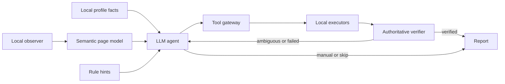

# LLM-First Resume Autofill Agent Architecture

> Version: 0.3 draft
>
> Date: 2026-08-22
>
> Status: approved direction, implementation pending

## 1. Product decision

The extension will move from **rules fill first, LLM repairs later** to an **LLM-led agent with local semantic tools**.

- The LLM owns semantic interpretation, mapping, tool selection, and bounded repair decisions.
- Local code owns observation, facts, tool execution, validation, privacy, authoritative readback, and safety.
- Rules become evidence for the agent and the no-API fallback. A rule match is never equivalent to a successful fill.
- The LLM never returns arbitrary JavaScript, CSS selectors, or executable code.
- Save, next, consent, submit, and job-application actions are not exposed as tools.

This is not a browser agent that receives unrestricted DOM access. It is a typed resume-filling agent operating on stable semantic IDs and an allowlisted tool protocol.

## 2. Why the current V2 is insufficient

The current V2 still follows a static pipeline:

```text
PageModel → rule candidates → one-shot LLM mapping → local execution
```

That design fails when perception or control shape is ambiguous:

- a row contains a document-type select and a document-number input under one label;
- a date may be one input, year/month parts, a start/end range, four parts, six parts, or an ongoing toggle;
- a custom select exposes its options only after interaction;
- repeated cards cannot be indexed until an add action changes the DOM;
- a tool attempt may reveal new state that requires a different plan.

A one-shot mapping response cannot inspect new state or repair its own tool choice. Sparse LLM output is also currently accepted silently, which makes the LLM appear present while contributing little.

## 3. Target architecture



The normal path should use two model rounds:

1. **Plan round:** return tool calls for all straightforward fields and explicit terminal decisions for the rest.
2. **Repair round:** receive only failed/ambiguous tool results, inspect additional state if needed, and retry with another valid tool or mark manual.

An uncertain control may require an extra observation tool call, but the agent has a strict turn budget. It cannot loop indefinitely.

## 4. Agent state machine

Each field has an independent state:

```text
observed
  → mapped
  → tool-planned
  → written
  → committed
  → verified

Any state may terminate as manual, skipped, or failed.
```

Each eligible field must receive exactly one terminal outcome. Missing fields in an LLM response are protocol errors, not silent unmatched fields.

Page execution proceeds as follows:

1. Build a sanitized page and control graph.
2. Build a fact catalog containing stable paths, types, sensitivity, and optional non-sensitive values.
3. Ask the agent to cover every eligible field.
4. Validate all tool calls locally.
5. Execute safe calls in a deterministic order.
6. Re-locate controls and read authoritative component state.
7. Send only failures and new observations to the repair round.
8. Produce a report separating rule hints, LLM decisions, tool calls, rejections, repairs, and final states.

## 5. Observation model

### 5.1 Semantic field

The observer must represent both a single control and compound rows:

```ts
interface AgentField {
  fieldId: string
  sectionId: string
  entryId?: string
  labels: string[]
  constraints: {
    required: boolean
    maxLength?: number
    existingState: 'empty' | 'non-empty' | 'locked' | 'unknown'
  }
  controlGroupId: string
  ruleHints: RuleCandidate[]
}

interface AgentControlGroup {
  controlGroupId: string
  shapeCandidates: ControlShapeCandidate[]
  parts: AgentControlPart[]
  compoundSiblings: string[]
  capabilities: Array<
    | 'write-text'
    | 'select-option'
    | 'select-many'
    | 'fill-date'
    | 'toggle'
    | 'upload-manual'
  >
}
```

Part IDs are opaque stable IDs. The model never receives or returns CSS selectors.

### 5.2 Dynamic inspection

The initial model contains only cheap observations. The agent may request more information for uncertain controls:

- option samples and loading state;
- linked Portal/listbox identity;
- selected-state representation;
- date option domains, such as four-digit years or months 1–12;
- compound-row sibling controls;
- repeated-entry structure and count.

Sensitive input values are never returned by inspection tools.

## 6. Profile fact catalog

The agent maps fields to facts rather than inventing raw values:

```ts
interface AgentFact {
  factId: string       // stable alias for the local path
  path: string         // e.g. educations[0].startDate
  label: string
  valueType: 'text' | 'enum' | 'date' | 'boolean' | 'number' | 'list' | 'date-range'
  sensitivity: 'normal' | 'personal' | 'sensitive' | 'restricted'
  hasValue: boolean
  value?: string       // only when privacy mode permits
}
```

Tool calls reference `factId` or `path`. The gateway resolves the real value locally. Therefore the model can map an ID-number field without receiving the ID number.

Derived facts are first-class and locally computed, for example:

- country/region from citizenship or ID type;
- phone country code and local phone number;
- highest-education school city;
- date ranges from start/end/current fields;
- award count and award summary;
- presence of a scholarship, exchange, recommendation, or student-leadership fact.

## 7. Tool protocol

### 7.1 Observation tools

```ts
inspect_section({ sectionId })
inspect_control({ fieldId })
inspect_options({ fieldId, query?: string })
inspect_entries({ sectionId })
```

Observation results contain labels, capabilities, part IDs, option text, and state classifications. They do not contain protected input values, cookies, tokens, storage, or files.

### 7.2 Action tools

```ts
fill_text_from_fact({ fieldId, factIds, transform: 'identity' | 'join-list' | 'aggregate-text' })

select_option_from_fact({ fieldId, factId, match: 'exact' | 'synonym' | 'normalized' })

fill_date_from_facts({
  fieldId,
  startFactId?: string,
  endFactId?: string,
  currentFactId?: string,
  requestedShape: 'auto' | 'single' | 'range'
})

set_boolean_from_fact({ fieldId, factId })

ensure_entries({ sectionId, desiredCount })

mark_manual({ fieldId, reason })
mark_skip({ fieldId, reason })
```

There is intentionally no generic `click`, `type`, `evaluate`, `run_js`, `save`, `next`, or `submit` tool.

### 7.3 Verification tools

Verification is normally automatic after every action. The agent may explicitly request:

```ts
verify_field({ fieldId })
verify_section({ sectionId })
```

Tool results use semantic evidence:

```ts
interface ToolResult {
  callId: string
  fieldId?: string
  status: 'verified' | 'ambiguous' | 'rejected' | 'failed' | 'manual'
  stage: 'mapped' | 'written' | 'committed' | 'verified'
  evidence: string[]
  errorClass?: 'semantic' | 'control' | 'validation' | 'stale-ref' | 'safety'
  retryable: boolean
}
```

Evidence never contains full sensitive values.

## 8. Date as an agent tool

Dates are canonical facts, not display strings. The agent chooses `fill_date_from_facts`; it does not manually concatenate values for individual inputs.

The control inspector reports possible shapes:

- one native date/month input;
- one custom date picker;
- year + month;
- year + month + day;
- start + end inputs;
- start year/month + end year/month;
- start/end year/month/day;
- any of the above plus an ongoing/current toggle.

Part classification uses multiple signals:

- number and order of controls;
- option domains, such as years or months;
- placeholder and accessible labels;
- separators and visual grouping;
- current/ongoing toggle proximity;
- component-selected-state changes after inspection.

The LLM selects the semantic tool and, when necessary, confirms the part interpretation. The local date executor validates that interpretation before selecting each year/month/day option. A full range string can never be written into every physical part.

For example, the same profile range can drive all of these layouts:

```text
2022-09 ~ 2026-06
[2022] [09] - [2026] [06]
[2022-09] - [2026-06]
[2022] [09] - [ ] [ ] + [current=true]
```

## 9. Select and Portal tools

`select_option_from_fact` is a state machine:

1. capture currently visible overlays;
2. activate one trigger;
3. associate the new/linked overlay with that trigger;
4. query or wait for options;
5. click one validated option;
6. verify selected state from component output, hidden model state, or overlay-close plus committed value;
7. close only the overlay opened by this call on failure;
8. return ambiguous/failed when only search text changed.

The agent can inspect options and choose a normalization strategy, but it cannot declare success. Only the verifier can.

## 10. Repeated entries

Repeated cards are detected through structural similarity, repeated label/control signatures, and add/delete action proximity, not tenant-specific class names.

The agent first calls `inspect_entries`, then `ensure_entries` when needed. The gateway validates that each add call increases the count by exactly one. It never exposes delete as an automatic tool.

Entry routing is explicit:

- education page entry N → education fact entry N;
- merged experience/project page → a local projection supplies a flattened route table;
- award page entry N → award fact entry N;
- a second run reuses existing entries and creates zero new cards.

## 11. Rules after the redesign

Rules remain valuable, but their role changes:

- produce section, field, and control-shape hypotheses;
- provide top-N mapping hints with evidence;
- execute a conservative no-API fallback;
- short-circuit only deterministic native controls with exact label/type compatibility.

When the LLM agent is enabled, rules do not write the page before agent planning. The model may accept, replace, or reject every hint.

## 12. Model protocol and provider compatibility

The preferred transport is Chat Completions/Responses-style native function calling with JSON Schema tools.

The extension must also normalize providers that return tool calls through a strict JSON action envelope. Provider capability is detected during API testing and recorded as:

- `native-tools`;
- `json-tools`;
- `mapping-only`;
- `unsupported`.

The agent mode must not be enabled for a provider until a tool-call round trip passes. Mapping-only providers may use the current static planner as a fallback, clearly reported in the UI.

## 13. Budgets and failure policy

- Typical model rounds per page: 2.
- Maximum repair rounds: 2.
- Maximum observation calls per ambiguous field: 2.
- Planning batches: up to 80 fields, at most 3 concurrent model requests.
- DOM action execution: serialized per frame; only independent native text writes may be grouped.
- Any incomplete LLM coverage is retried once; remaining fields become manual with an explicit reason.
- A failed section does not block other sections.
- A tool call rejected by local validation is reported to the model once and cannot be repeated unchanged.

## 14. UI observability

The panel must show:

- observed sections/entries/fields;
- rule hints generated;
- LLM provider capability and model rounds;
- tool calls proposed, accepted, and rejected;
- verified, repaired, manual, and failed counts;
- per-field failure class and final reason;
- number of entries added;
- a persistent `not saved / not submitted` indicator.

Users must be able to distinguish “LLM was called” from “LLM produced a valid tool plan.”

## 15. Generalization evaluation

Tests must randomize tenant-specific presentation while preserving semantic structure:

- opaque class names and different nesting depths;
- compound rows such as document type + number and country code + phone;
- every supported date layout and option ordering;
- native, mirrored, searchable, remote, and Portal selects;
- multiple simultaneously present overlays;
- zero, one, and several repeated entries;
- merged and split profile sections;
- sparse, invalid, timeout, and hallucinated model tool calls;
- existing non-empty and locked controls;
- safety-action click counters.

Fixture success is a contract test. A platform is `live-verified` only after the same agent trace passes on a logged-in page with no save or submit action.

## 16. Migration plan

1. **A1 Contracts:** add agent observation, tool call, tool result, and trace types alongside V2.
2. **A2 Generic capabilities:** implement compound rows, dynamic selects, dates, and repeated-entry inspection without site-specific values.
3. **A3 Tool gateway:** implement allowlisted local tools and safety validation.
4. **A4 Agent loop:** implement native/JSON tool calling, mandatory field coverage, and two repair rounds.
5. **A5 Shadow mode:** run agent planning and tool validation without writes; compare with current V2.
6. **A6 Controlled rollout:** enable writes on synthetic fixtures, then Moka, Dayee WT, and Kuma live gates.
7. **A7 Remove static default:** only after agent-mode live acceptance, retire rule-first platform defaults.

Until A6 passes, the current V2 must not be described as a generalized agent.
